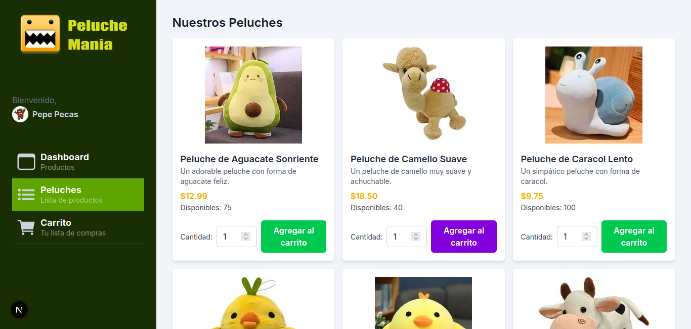
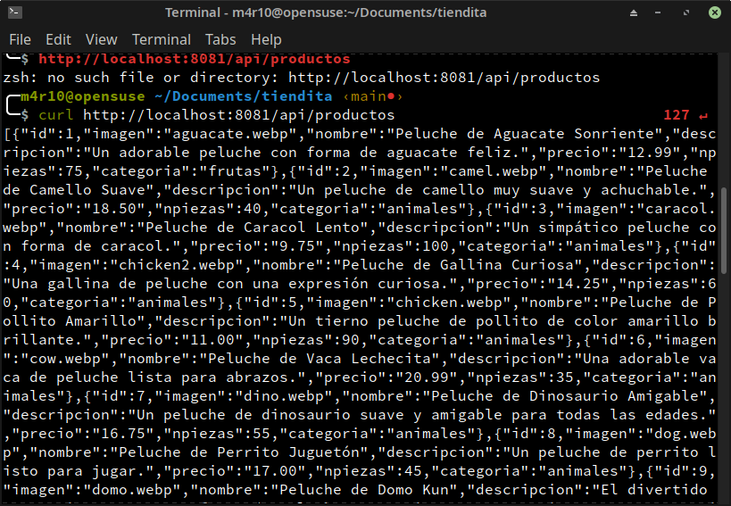

# Tiendita de peluches
Pagina web que simula una tienda de peluches.


- Integracion de Docker
- API con Node (Conexion con bd y salida en json)
- Web 

Es forzosamente necesaro tener que integrar el docker Para poder levantar los servicios de sql,api y veb



### Docker
* Para iniciarlo la primera vez
    ```bash
    docker-compose up -d --build
    ```
* Ejecutar normal el proyecto
    ```bash
    docker-compose up -d 
    ```
* Para correr algun servicio en especifico
    ```bash
    docker start mysql_tienda
    docker start tienda_api
    docker start tienda_web
    ```

NOTAS: aprendi que con el docker no es instantaneo el levantamiento de la bd. Por lo cual hay que hacer un retardo en la api.
Por el momento tome el root en la bd para la api, es mala practica pero fue necesario para ver su funcionamiento correcto.

### SQL
Puedes acceder de igual forma a la base con phpadmin en el puerto 8082

### API
para saber como usar la api puedes entrar a la api/README.md, donde encontraras ejemplo de uso.
Accede a la api con el puerto 8081

